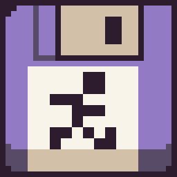
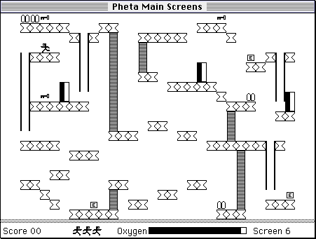
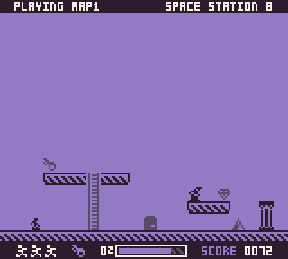

**Space Station 8** is a `Mico Platformer` created [in 72 hours for Ludum Dare 49](https://ldjam.com) based on a game I used to play on my original Macintosh called [Spacestation Pheta](https://en.wikipedia.org/wiki/Spacestation_Pheta). Space Station 8 is also heavily inspired by [Bitsy](http://make.bitsy.org) and my Fantasy Console, [Pixel Vision 8](https://pixelvision8.com), which I used to create the game.

The goal of Space Station 8 is to escape before you run out of oxygen. To do that, you will need to navigate the level, find the key, and make it to the exit in time. Each level is self-contained, and you are scored based on your ability to complete it within the amounted time and lives. There are also some prized gems you may want to collect on your way out while avoiding aliens and other deadly obstacles like spikes.

Like the original game this is based on, there is a built-in map editor. In fact, there are no pre-made maps at all! The twist is that I lost them after space junk hit the station, so I need everyone's help to make new ones and share them with others.

Ready to get started? The documentation will teach you everything you need to know for making, sharing, and playing your Space Station 8 maps.

