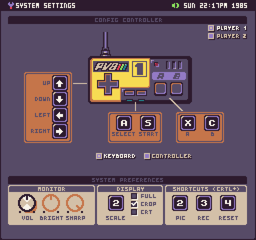
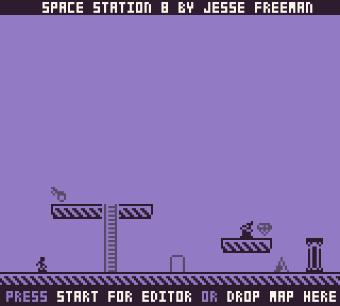
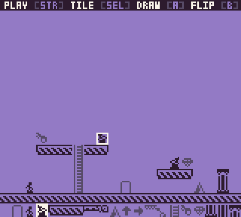
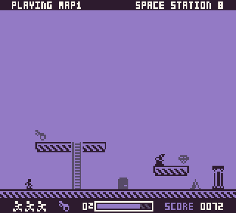

Pixel Vision 8 supports a keyboard, mouse, and controller. Space Station 8 supports all three but was designed around the controller mapping. You can modify the mapping at any time by hitting `ESC` and going into the settings.

Here are all the input options based on what screen you are on:

## Splash

| Action | Keyboard | Mouse | Controller | Note |
| ------ | -------- | ----- | ---------- | ---- |
| Start | S | N/A | Start ||
| Settings | ESC | N/A | N/A | Works on every screen |

## Editor

| Action | Keybaord | Mouse | Controller | Note |
| ------ | -------- | ----- | ---------- | ---- |
|  Play | S | N/A | Start | Hold for 3 seconds |
|  Quit | A + S | N/A | Select + Start | Hold for 3 seconds |
|  Up | Up Arrow | Move Up | Up | Mouse shows up when moving |
|  Down | Down Arrow | Move Down | Down | Mouse shows up when moving |
|Left | Left Arrow | Move Left | Left | Mouse shows up when moving |
| Right | Right Arrow | Move Right | Right | Mouse shows up when moving |
| Tile | A | Click on Tile | Select | Cycles to the next tile |
| Paint | X | Left-Click | A | Draws tile |
| Flip | C | Right-Click | B | Flips the tile if it can be |

## Game

| Action | Keybaord | Mouse | Controller | Note |
| ------ | -------- | ----- | ---------- | ---- |
| Quit | A | N/A | Select | Hold for 3 seconds |
| Up | Up Arrow |N/A | Up | Moves up ladders |
| Down | Down Arrow | N/A | Down | Moves down ladders |
| Left | Left Arrow | N/A | Left ||
| Right | Right Arrow | N/A | Right ||
| Jump | X | N/A | A ||
| Jump | C | N/A | B ||