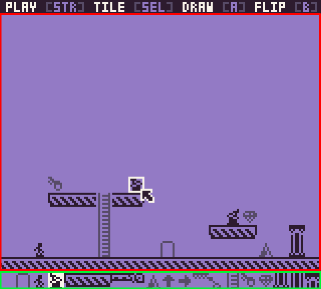

When you first load Space Station 8 up, you will be presented with the default map. You can immediately begin editing it, or you can drag a `spacestation8.png` map onto the game and load that up. 

Space Station 8 map's should be at least `160` x `132` pixels:

You can also provide a map that is `160` x `152`, where the last two rows are the sprites for the map:

Whenever you go to the splash screen, Space Station 5 will automatically create a new `map.spacestation8.png` for you in your `/Levels/` folder:
| Version | Path                                                   |
| ------- | ------------------------------------------------------ |
| Windows | C:\\Users\\UserName\\Documents\\SpaceStation8\Levels\\ |
| MacOS   | /Users/UserName/PixelVision8/SpaceStation8/Levels/     |
| Linux   | /Users/UserName/PixelVision8/SpaceStation8/Levels/     |

Before you can play a map, you'll be taken to the map editor. The editor has two main areas, the map and the tile picker on the bottom:

The white blinking box in the map area previews where the tile will be drawn. You can move the tile highlighter via a controller's d-pad, the keyboard arrows, or the mouse. By default, the mouse is hidden unless you move it.

You can pick from any of the 20 tiles on the bottom of the screen to draw with. The tile with the white background is the currently selected tile. You'll also see it previewed on the map. Some tiles have a flip or alternative state. This can be used for changing the direction of an enemy or spikes.

Finally, for a map to work, you need three things: a player, a key, and a door. When you start the game, if these things are not present, it will bring you back to the editor. There is no cap on how many players, keys, or doors you can draw on the map, but the game will only use the first of each when it processes all the tiles.