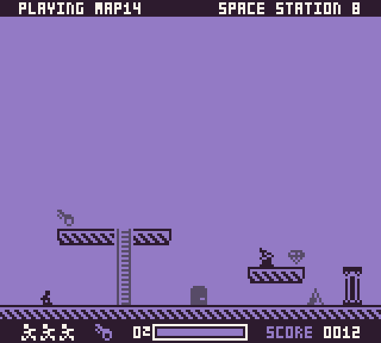

Once you start the level, you have to make your way to the exit before running out of oxygen. To open the door, you will need to find the key then walk through the door:

Along the way, you will have to avoid the following collectibles and hazards:
| Sprite | Name | Value | Description |
| ---- | ---- | --- | --- |
|  | Alien | N/A | Avoid these guys, or they will instantly kill you. |
|  | Door | 500 pts | Starts as locked and will unlock once you pick up the key. |
|  | Key | 50 pts |  Opens the door to escape. |
|  | Gem | 100 pts | Collect this for extra points. |
|  | Ladder | N/A | Allows you to walk up and down. |
|  | Platform | N/A | Allows you to jump onto from below and drop down from when on. |
|  | Spikes | N/A | Spikes will kill you if you land or jump on one. You can walk past spikes without taking damage. |
|  | Switch | N/A | This is not implemented yet. |