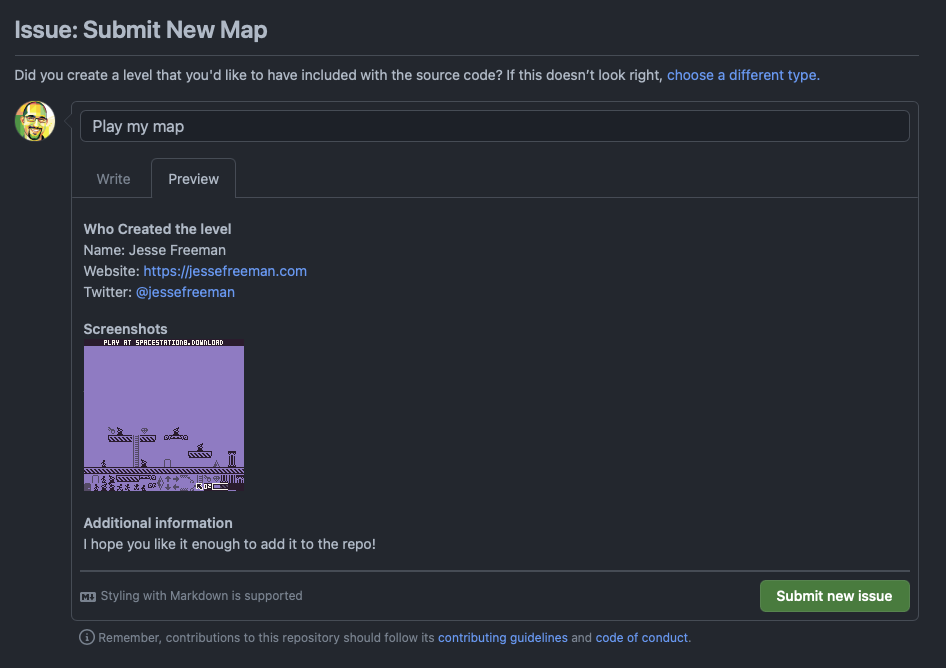

Once you are happy with a level, you can share it with someone else by sending them the `map.spacestation8.png` file. There are several ways to do this. You can attach it in a comment below, send it directly to them, or [file a ticket on GitHub](https://github.com/PixelVision8/SpaceStation8/issues/new?assignees=jessefreeman&labels=map&template=new_map.md&title=) and include it there.

One thing to note is that some social networks like Twitter may compress the image. This will break the tilemap parser unless the image is pixel-perfect at 160 x 132 or 160 x 142. 

The default map template looks like this:

As you can see, a map is comprised of a `20` x `17` tile grid where each tile is `8` x `8` pixels. The top row is ignored, and for map images that are `142` pixels high, the last two rows (`18` and `19`) are used for the game's sprites.

There are `40` sprites which you can also modify if you want to reskin the game. Each sprite is fixed to a corresponding element in the game, so while you can re-skin the graphics, you will not make new ones or change the internal sprite mapping.

The last thing to keep in mind when modifying the sprites, or even using a drawing tools like [Aseprite](https://www.aseprite.org) to modify map files, is that you will have to use the following four colors (`#2D1B2E`, `#574B67`, `#937AC5`, #F9F4EA) .

